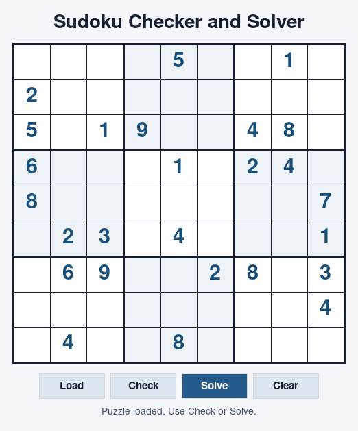
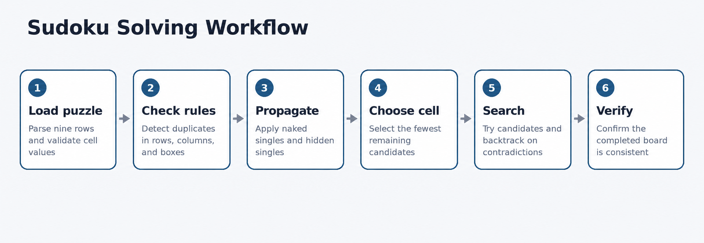

# Sudoku Checker and Solver



A Python application for validating and solving standard 9×9 Sudoku puzzles. It checks row, column, and 3×3 box constraints, applies logical solving techniques, and uses efficient backtracking when deduction alone is not enough.

## Features

- Validates incomplete and completed Sudoku boards
- Highlights conflicting cells in the desktop interface
- Applies naked singles and hidden singles
- Uses minimum-remaining-values backtracking for difficult puzzles
- Supports `.sdk` and plain-text puzzle files
- Includes both command-line and Tkinter interfaces
- Requires only the Python standard library

## Run

Python 3.10 or later is recommended.

Solve the included sample:

```bash
python main.py data/sample.sdk
```

Check a board without solving it:

```bash
python main.py data/sample.sdk --check
```

Open the desktop interface:

```bash
python main.py data/sample.sdk --gui
```

Save a solution:

```bash
python main.py data/sample.sdk --output solved.sdk
```

A puzzle file contains nine rows. Use digits for known values and `.` or `0` for empty cells.

```text
....5..1.
2........
5.19..48.
6...1.24.
8.......7
.23.4...1
.69..28.3
........4
.4..8....
```

## Solving approach

1. Reject duplicate values in any row, column, or box.
2. Fill cells with one legal candidate.
3. Place values that have only one possible location inside a unit.
4. Choose the empty cell with the fewest candidates and search recursively.
5. Backtrack immediately when a contradiction appears.



## Tests

```bash
python -m unittest discover -s tests -v
```

## Structure

```text
sudoku_solver/   Core logic, file I/O, CLI, and GUI
data/            Example puzzles
tests/           Automated tests
images/          Project visuals
main.py          Application entry point
```
